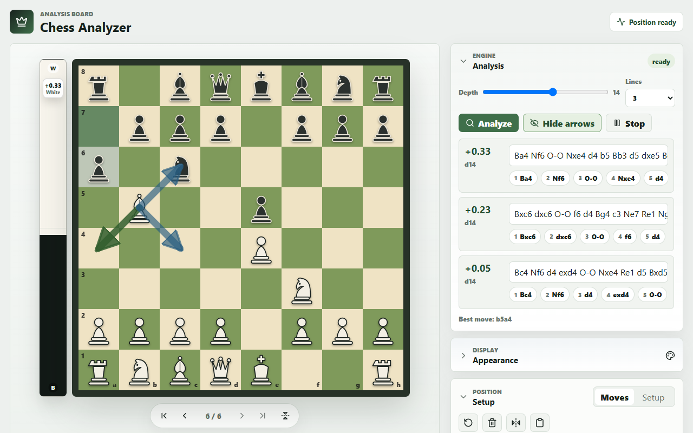
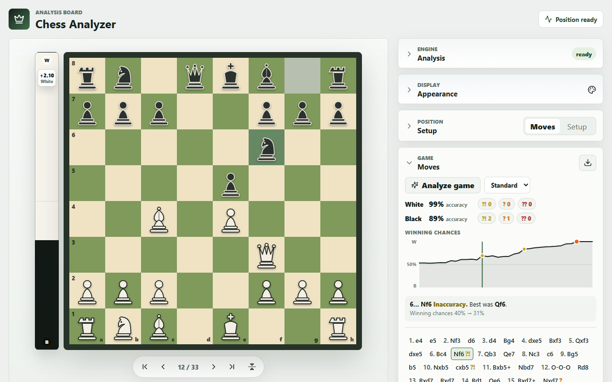
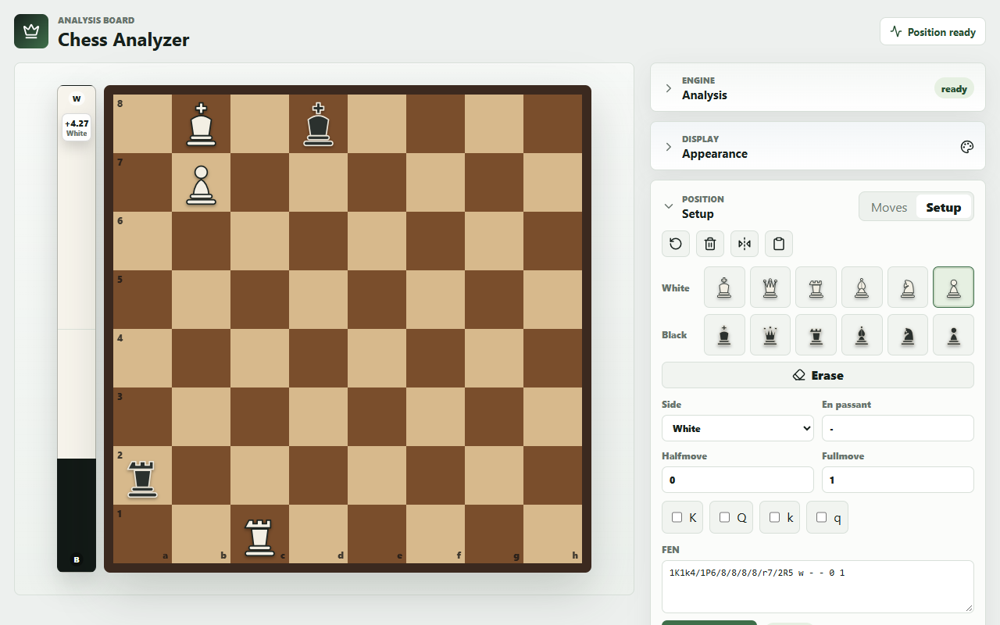
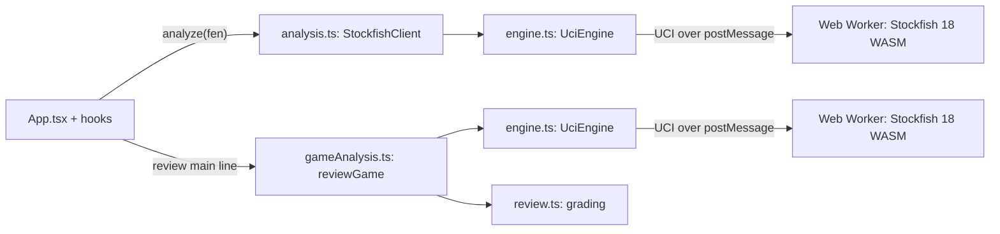

# Chess Analyzer

A chess analysis board that runs Stockfish 18 in the browser, as WebAssembly in a Web Worker, with an eval bar, up to three engine lines and a move-by-move game review.



**[Live demo](https://www.adriangaona.dev/demos/chess/)** · [Project page](https://www.adriangaona.dev/work/chess-analyzer)

Play through or set up a position and the engine analyzes it as you go. Load a PGN and run a review to get every move graded, with per-side accuracy and a winning-chances graph. It is for players who want quick, private analysis without an account: the engine runs on the client, so the app is a set of static files and your games never leave the browser.

| Game review | Position setup |
| --- | --- |
|  |  |

## Contents

- [Features](#features)
- [Engineering highlights](#engineering-highlights)
- [Tech stack and design decisions](#tech-stack-and-design-decisions)
- [Getting started](#getting-started)
- [Tests and CI](#tests-and-ci)
- [Configuration](#configuration)
- [Limitations](#limitations)
- [License](#license)
- [Author](#author)

## Features

- **Analysis board.** Move by clicking or dragging, with legal targets highlighted and a promotion picker. Check, checkmate, stalemate and the standard draw rules are announced. Keyboard: ← / → to step, Home / End, F to flip.
- **Live engine analysis.** Eval bar from White's side (forced mates shown as `+M3` or `-M2`), 1 to 3 lines (MultiPV), depth 6 to 20, and optional arrows for each line's first move. Click any move in a line to step through it on the board.
- **Move tree.** Playing a different move from an earlier position starts a variation. Right-click a move to promote it to the main line or delete from there. While you explore, a move gets a `?!`, `?` or `??` mark once the engine has finished the positions before and after it.
- **Game review.** Grades every main-line move as best, good, inaccuracy, mistake or blunder, shows the better move for each error, per-side accuracy and error counts, and a clickable winning-chances graph. Quick, Standard and Deep budgets; a review can be stopped part-way.
- **Position setup.** Piece palette, side to move, castling rights, en passant and move counters. FEN import with validation that also rejects castling rights the board can't back up (Stockfish can hang on them) and positions where the side not to move is in check; a PGN's `[FEN]` starting position gets the same checks. FEN and PGN copy, PGN import.
- **Appearance.** Six board themes, three piece sets and synthesized move sounds, remembered between visits when the browser allows local storage.
- **Accessible board.** Squares are buttons labeled with the square and piece ("e4, white pawn").

## Engineering highlights

- **A UCI controller that sends nothing but `stop` during a search** ([`src/lib/engine.ts`](src/lib/engine.ts)). The single-threaded WASM build crashes (`RuntimeError: unreachable`) on a burst of commands mid-search, so `UciEngine` sends only `stop` while a search runs and waits for `bestmove`. A newer search stops the running one and skips queued ones. A crashed worker is replaced and the search retried up to twice; so is one that ignores `stop` for 3 s or says nothing for 10 s after `go`. Failures carry a typed `code`.
- **Tests against a fake engine that behaves like the real one** ([`tests/fakeStockfish.ts`](tests/fakeStockfish.ts)). The scripted worker crashes on any command other than `stop` or `isready` during a search, and it records each such command as a violation. Options make it crash on `go` or ignore `stop`. The engine tests assert that no violations happen, and they cover recovery, giving up after repeated crashes, and recovering on the next search.
- **Grading on winning chances, not raw centipawns** ([`src/lib/review.ts`](src/lib/review.ts)). Scores go through Lichess's logistic fit (capped at ±10 pawns) to winning chances on a −1…1 scale. A move is an inaccuracy, mistake or blunder when it drops them by at least 0.1, 0.2 or 0.3. Per-move accuracy uses Lichess's formula. Forced mates have their own rules (allowing one, missing one), and playing the engine's own best move is never an error.
- **A second look before calling a move an error** ([`src/lib/gameAnalysis.ts`](src/lib/gameAnalysis.ts)). Comparing two separate searches can punish a good move because of the horizon effect. So every flagged move is searched again from the position before it with `searchmoves`, on the same budget, and the higher of the two scores for the move is used. Budgets are node counts (60k, 250k, 1M), not depths, so the work per position is bounded and a re-run gives the same result.
- **Live analysis that can't show stale lines** ([`src/lib/analysis.ts`](src/lib/analysis.ts)). Each `analyze()` call starts a new generation, and every update carries the FEN it belongs to. Updates from older generations or other positions are dropped, so moving quickly never leaves the previous position's lines on screen.

## Tech stack and design decisions

| Piece | Why |
| --- | --- |
| React 18, TypeScript (`strict`), Vite 6 | A single-page app with static output. `npm run build` type-checks the app, the tests and the Vite config before bundling. |
| [chess.js](https://github.com/jhlywa/chess.js) 1.4 | Move legality, SAN, FEN and PGN, so the app doesn't reimplement the rules. |
| Stockfish 18 lite, single-threaded ([`stockfish`](https://github.com/nmrugg/stockfish.js) npm package) | The lite build is about 7 MB of WASM, against about 113 MB for the full one. The single-threaded variant needs no `SharedArrayBuffer`, so the page needs no cross-origin isolation (COOP/COEP headers) and runs from any static host or inside an iframe. The multi-threaded builds need both. |
| Web Worker | Searches run off the main thread; the app talks UCI to the worker over `postMessage`. |
| React hooks per concern | `App.tsx` owns the game (setup position and move tree); live analysis, game review, move grading, line preview, appearance settings and keyboard shortcuts each live in their own hook under `src/hooks/`. Chess logic stays in plain functions under `src/lib/`, so it is tested without React. |
| Vitest | Fast unit tests for the engine protocol, grading, FEN validation and the move tree, with no browser needed. |
| ESLint (typescript-eslint, React hooks rules) | `npm run lint` fails on any warning. It includes the React Compiler checks from `eslint-plugin-react-hooks` 7, such as no `setState` calls in effects; the one deliberate exception is explained in `useLiveAnalysis.ts`. |
| nginx (Docker) | Serves the static build as an unprivileged user, with a Content-Security-Policy that allows only the app's own files (plus `'wasm-unsafe-eval'` for the engine) and the usual hardening headers. |



Game review runs on its own engine instance, and live analysis pauses while a review is running.

```text
src/
├── main.tsx                 Entry point
├── App.tsx                  Setup position and move tree, wired to the hooks and panels
├── styles.css
├── hooks/
│   ├── useLiveAnalysis.ts   Debounced live analysis of the board position
│   ├── useGameReview.ts     Review runs, progress, summary and graph data
│   ├── useMoveGrading.ts    ?!, ? and ?? marks while exploring
│   └── useVariationPreview.ts, useAppearanceSettings.ts,
│       useKeyboardShortcuts.ts, useResettableState.ts
├── lib/
│   ├── engine.ts            UCI controller: one search at a time, crash and hang recovery
│   ├── analysis.ts          Live analysis client; drops updates for stale positions
│   ├── gameAnalysis.ts      Game review: node budgets, second look at flagged moves
│   ├── review.ts            Grading: winning chances, accuracy, mate rules
│   ├── position.ts          FEN parsing, building and validation; UCI to SAN
│   ├── gameTree.ts          Move tree with variations; PGN import and export
│   ├── boardMove.ts         Legality and promotion check for a move made on the board
│   ├── evaluation.ts        Scores from White's side for the eval bar and labels
│   ├── storage.ts           localStorage access that falls back when the browser blocks it
│   └── arrows.ts, gameStatus.ts, variation.ts, nags.ts, sound.ts, themes.ts
└── components/
    ├── ChessBoard.tsx       Click and drag moves, legal targets, SVG arrows
    ├── AnalysisPanel.tsx    Depth, line count, engine lines, line preview
    ├── MovePanel.tsx        Move list, PGN, review summary
    ├── EvalGraph.tsx        Winning-chances graph
    ├── SetupPanel.tsx       Piece palette, position fields, FEN
    ├── AppearancePanel.tsx  Themes and sound
    └── EvalBar.tsx, GameNavBar.tsx, GameStatusBanner.tsx, PromotionOverlay.tsx,
        VariationBanner.tsx, PieceIcon.tsx, CollapsiblePanel.tsx
tests/                       Vitest suites, FEN and engine-output fixtures, the fake Stockfish worker
scripts/copy-stockfish.mjs   Copies the engine and its GPL-3.0 license into public/
public/vendor/stockfish/     Stockfish 18 lite single-threaded build and its license
.github/workflows/ci.yml     Lint, type-check, test and build
Dockerfile, nginx.conf       Static build served by nginx
```

## Getting started

**Prerequisites:** Node.js 20.19+, 22.13+ or 24+ with npm, as set in `engines` in `package.json` (ESLint's dependencies need it). Tested with Node 20.20 and 22.22. Docker is optional.

```bash
git clone https://github.com/jadrianlg16/chess-analyzer.git && cd chess-analyzer
npm ci
npm run dev        # http://127.0.0.1:5173
```

`npm run dev` and `npm run build` first copy the engine files from `node_modules/stockfish` into `public/vendor/stockfish/`. The first page load downloads the engine (about 7 MB), so the status pill shows `loading` for a moment before the analysis starts.

**Production build:**

```bash
npm run build      # type-check, then build to dist/
npm run preview    # serve dist/ at http://127.0.0.1:4173
```

`dist/` is plain static files, so any static host works.

**Docker:**

```bash
docker build -t chess-analyzer .
docker run --rm -p 5016:80 chess-analyzer    # http://localhost:5016
```

The image runs the same `npm run build` (type check included) and serves `dist/` with nginx on port 80, as the unprivileged `nginx` user. [`nginx.conf`](nginx.conf) sets the security headers; the policy only allows the page to be framed by itself.

## Tests and CI

```bash
npm test           # Vitest, once
npm run lint       # ESLint, fails on any warning
npm run typecheck  # tsc for the app, the tests and the Vite config
```

The suites cover the UCI parser and engine controller (serialized searches, superseded searches, crash and hang recovery, search timeouts, stop, dispose), the live analysis client (stale updates, crash reporting), the review pipeline against the fake Stockfish (second look, cancellation), the grading math (winning chances, accuracy, mate rules), FEN validation and round trips against valid and invalid fixture FENs, the move tree (variations, promotion, deletion, PGN import and export) and the board helpers. Nothing touches the network or needs a browser. There are no browser or UI tests yet; the UI is checked by hand.

[`.github/workflows/ci.yml`](.github/workflows/ci.yml) runs `npm ci`, lint, type check, tests and build on Node 20 and 22 for pushes to `main` and for pull requests, then checks that the build left no tracked file modified. The workflow is committed but has not run on GitHub yet.

## Configuration

There are no environment variables or runtime settings. The one build-time option is Vite's base path. Engine URLs are built from `import.meta.env.BASE_URL`, so the app also works under a subpath:

```bash
npx vite build --base=/demos/chess/
```

The live demo is served this way, from `/demos/chess/`. In Git Bash on Windows, prefix the command with `MSYS_NO_PATHCONV=1`; otherwise Git Bash rewrites `/demos/chess/` into a Windows path.

## Limitations

- **Engine strength.** The lite build is weaker than full Stockfish, and it searches on a single thread, so it is also slower than native, multi-threaded Stockfish. Depth tops out at 20 in the UI.
- **PGN.** Import keeps only the main line; variations and comments in the file are dropped. Export and game review cover the main line only.
- **Nothing is saved.** A reload starts a new game; only the appearance settings are kept, and not even those when the browser blocks site data.

## License

Copyright © 2026 Adrián Gaona. All rights reserved. The source is public so it can be read and evaluated; no license is granted to reuse or redistribute it.

Third-party components keep their own licenses:

- **Stockfish** (the files in `public/vendor/stockfish/`, from [stockfish.js](https://github.com/nmrugg/stockfish.js), based on [Stockfish](https://github.com/official-stockfish/Stockfish)) is GPL-3.0. Its license text ships next to the engine in [`public/vendor/stockfish/LICENSE`](public/vendor/stockfish/LICENSE) and in every build.
- chess.js is BSD-2-Clause; React and React DOM are MIT; lucide-react is ISC.

## Author

**Adrián Gaona** · [adriangaona.dev](https://www.adriangaona.dev) · [LinkedIn](https://www.linkedin.com/in/jesus-lopez-95762b2b6) · [GitHub](https://github.com/jadrianlg16)
